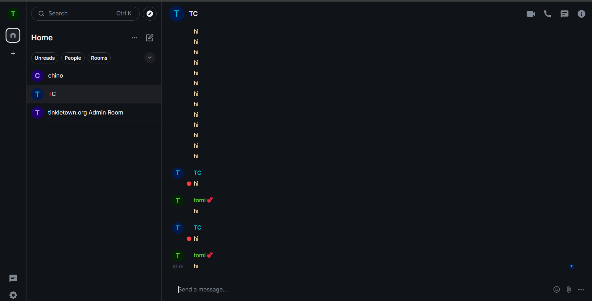
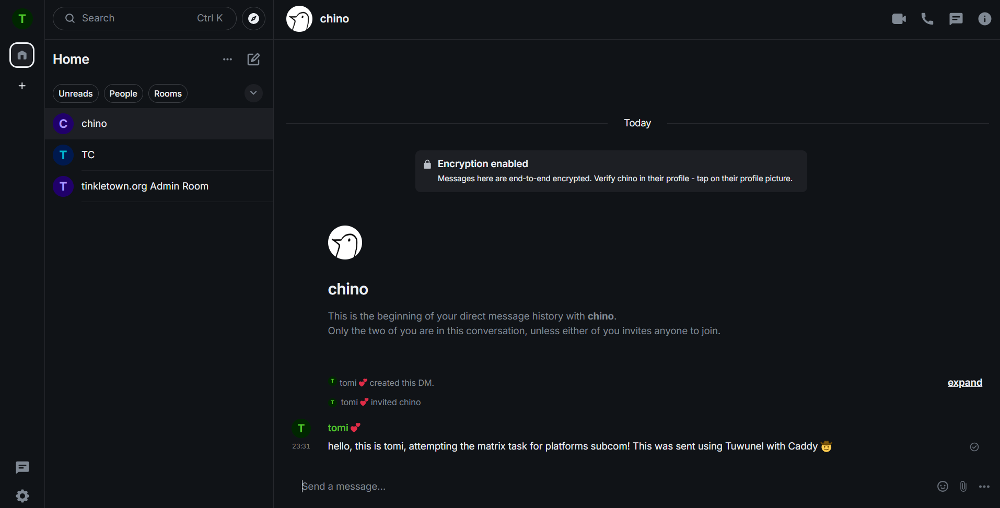

# Matrix Assessment Report

> [!TIP]
> Use this document to record your progress, the problems you faced and how you solved (or avoided) them.
> You can include images or add files in this directory if you want.

#### My work flow and thought process

- First thing's first: so obviously when I saw that a domain name is required, I had to quickly register one with a great name. I bought tinkletown.org which was $10 from cloudflare.
- Then, I had to figure out what I'm actually supposed to be doing, so I looked through matrix.org and tuwunel docs, and installed caddy
- I had quite a few challenges running caddy with my domain though. From permissions to WSL issues to non existing domain errors, I solved them one by one simply by googling it and clicking on a stackoverflow/forum page. Thankfully, there were solutions to all the issues I've faced thus far by other newbies attempting this same project.

- The real challenge came when caddy was giving me errors, specifically a validation authorisation error, as well as an unresolved certificate error. As I don't come from a network background, I had no idea what these meant, and I was completely stuck. To add insult to injury, I was getting rate limited because I was failing this connection too many times! 
- After pasting the error into google and doing a bunch of research, I saw someone talk about cloudflare tunnels, which allowed communication without a publicly routed IP address. For the purposes of this task, this seemed perfect. I should mention that although I explain this in one bullet point, I had to do a lot of trial and error with other methods to try to fix this (or I thought would only be worth trying after experimenting with tunnels), for example, using http instead of https, port forwarding, and playing with dns records!

- After this, I ran into another issue, where attempting to cargo build tuwunel would crash my laptop. It kept giving me a vague error message after spamming my terminal with "exit status 0" for some reason, and I initially thought that there was an issue with some dependency or installation conflicts, but I eventually figured out that it was taking up 90% memory and 100% disk which was quite concerning... and at one point, I couldnt stop the build because my entire laptop was frozen. Further, it crashed WSL as well and refused to restart, unless I did a full reboot of my laptop. I fixed this by limiting cargo to only use 2 threads. Although this increased the time it took to build (to about 30 minutes), it succeeded, which was the important part.

- After setting up tuwunel, caddy, cloudflare tunnel, and an element account, I still couldn't get it to work. Apparently, all requests were failing because of too many redirects, so I checked, and turns out, I was getting redirected between two sites infinitely, the :80 port and my tinkletown.org domain. I tried switching the Caddyfile config to point at :80 instead of tinkletown.org, and that fixed it! I would not be able to explain to you why that worked (something I would want to look into in the future), but intuitively I was thinking "well, pointing at tinkletown just made it redirect to :80 and loop, so why not just point at :80?" and that worked.

- After fixing configurations and allowing user registration (I forgot to do this earlier and was stuck for a while, oops!), I managed to get the server up and running, and I tested this successfully with curl. However, I had issues with trying to get Element to recognise my homeserver, because I didn't include any CORS config! But not to worry, someone on a forum had a similar issue and provided some sample code, which worked wonderfully for my purposes.

#### Things I had trouble with
- There were times where I ran into permission issues, and I worked around this simply by running everything with admin perms (sudo). I don't think this is the right approach, but I chose to do this for the purposes of the task just to get it up and running as soon as I could. I'm interested in learning what the best practice is for these issues but unfortunately this will have to wait for another day.

- Why why why is browser caching so good and so bad at the same time? Yeah it's great for the general use case, but when I try to register an account on Element, I kept getting the same error message in the console, when I thought I had already fixed it! I thought I was becoming delusional! Turns out, opening a new page in incognito mode "magically" fixed all my issues.. which is quite annoying but also interesting to take note of for the future.

#### Things I appreciated
- The documentation for ALL the services I used (or tried to use, even) were AMAZING! They were beginner friendly and widely supported, and there seemed to be a lot of community support as well in forums. It was surprisingly not *tooooo* difficult to troubleshoot, and I didn't really run into too many problems where I had to figure it all out on my own. This was quite surprising to me (a good surprise!) because in my limited experience messing with networks stuff (like during my internship and other small projects), it took a lot of time and effort to troubleshoot and bug fix.

- This task really just consisted of me seeing something I don't understand, researching it, implementing it, failing and getting errors, researching more, and fixing it. I don't think I've ever learnt a new technology at this rate before, and it was quite fun to do.

- It was extremely rewarding to finally see that first message come in. This is me messaging myself over and over !  and this was my message to `@chino:oxn.sh` ! 

#### Summary
- Going into this I had no idea what any of these technologies were. I felt so intimidated by all the new technical terms and layers of network protocols, but slowly looking it up one by one, reading the documentation, and following some tips from forums made this challenge quite doable. For reference, the actual work (like typing code and clicking stuff) probably took about an hour or two, but the research that went into it was a significantly longer ~10 hours! (this is also not including when my code editor and laptop crashed repeatedly). This was quite a fun challenge nonetheless, and whoever designed it gave me a newfound appreciation for these technologies for sure.

## Matrix Handle

`@tomi:tinkletown.org`
